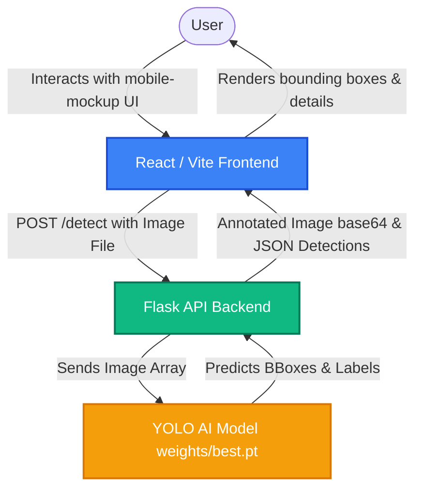

# EcoOps 🌍

EcoOps is a gamified, mobile-first community waste management platform designed to make recycling engaging and accessible. By combining **real-time AI object detection (YOLO)**, **gamified rewards**, **interactive maps**, and **community reporting**, EcoOps empowers citizens to actively participate in building cleaner, more sustainable cities.

---

## 🚀 Key Features

*   **🧠 AI Garbage Classification:** Upload images of waste directly in the app to get instant YOLOv8-powered object detection, bounding-box annotations, and classification confidence scores.
*   **📍 Interactive Facility & Vehicle Tracker:** Find local recycling centers, composting areas, scrap shops, and hazardous waste dump points via OpenStreetMap, with filters. You can also track waste collection vehicle locations and estimated times of arrival (ETA).
*   **🏆 Gamified Leaderboards & Challenges:** Earn points for recycling, complete daily sustainability challenges (e.g., *"Scan 5 plastic bottles today"*), and climb the individual and locality leaderboards.
*   **🛍️ Eco Marketplace:** Redeem your hard-earned points for eco-friendly products and rewards.
*   **📚 Training & Quizzes:** Take lessons on waste management basics, composting, and sorting techniques, complete quizzes, and earn extra points.
*   **🚨 Geotagged Community Reporting:** Report issues such as overflowing public bins, illegal waste dumping, or public littering directly to local authorities with optional photo attachments.

---

## 🛠️ System Architecture

EcoOps uses a decoupled architecture with a mobile-first React frontend communicating with an AI-inference Flask backend:



---

## 📂 Repository Structure

```text
garbage_management_eco_ops/
├── ai5/                        # Flask Backend & ML Engine
│   ├── weights/                # YOLOv8 Custom weights (best.pt)
│   ├── images/                 # Test dataset images
│   ├── flask_app.py            # API routing and inference entry point
│   ├── requirements.txt        # Python package dependencies
│   └── test_load.py            # Script to run quick CLI inference test
├── eco-ops-app/                # Mobile-First Web App (Vite + React)
│   ├── public/                 # Static assets
│   ├── src/                    # React components and styles
│   │   ├── App.jsx             # Main dashboard, map, and AI scan tabs
│   │   ├── App.css / index.css # Custom app styles
│   │   └── main.jsx            # Entry mount point
│   ├── package.json            # Node.js dependencies & scripts
│   └── vite.config.js          # Vite config
└── README.md                   # Project documentation (this file)
```

---

## 🚦 Getting Started

### 1. Set Up and Run the AI Backend (`ai5`)

The backend runs on Python 3 and serves predictions via Flask.

1.  **Navigate to the backend directory:**
    ```bash
    cd ai5
    ```
2.  **Create and activate a virtual environment:**
    ```bash
    python3 -m venv .venv
    source .venv/bin/activate
    ```
3.  **Install dependencies:**
    ```bash
    pip install -r requirements.txt
    ```
4.  **Start the server:**
    ```bash
    python flask_app.py
    ```
    The backend will start and run on `http://localhost:5000`.

### 2. Set Up and Run the Frontend (`eco-ops-app`)

The frontend is a React application built with Vite and styled with Bootstrap.

1.  **Navigate to the frontend directory:**
    ```bash
    cd ../eco-ops-app
    ```
2.  **Install npm packages:**
    ```bash
    npm install
    ```
3.  **Run the local development server:**
    ```bash
    npm run dev
    ```
4.  **Open in your browser:**
    Visit `http://localhost:5173` (or the port specified in your console). Toggle your browser's Developer Tools to **Mobile View** (e.g., iPhone 12/13/14 size) for the optimal mobile-first layout!

---

## 📊 AI Model Details

*   **Model Architecture:** YOLOv8 (Ultralytics)
*   **Task:** Object Detection & Garbage Classification
*   **Custom Weights File:** [best.pt](file:///Users/krishna/Code/garbage_management_eco_ops/ai5/weights/best.pt)
*   **Output Parameters:** Class labels, confidence scores, and raw pixel bounding box coordinates (`[xmin, ymin, xmax, ymax]`).

---

## ✨ Future Enhancements

*   **👷 Worker Interface:** Develop the fully functional backend logic for waste collectors, including route optimizations and collection job claims.
*   **🗺️ Map Integrations:** Replace static OpenStreetMap export frames with interactive Mapbox/Leaflet bindings for smoother map markers.
*   **📱 Native Mobile Builds:** Compile the React frontend to iOS/Android using Capacitor or React Native.
